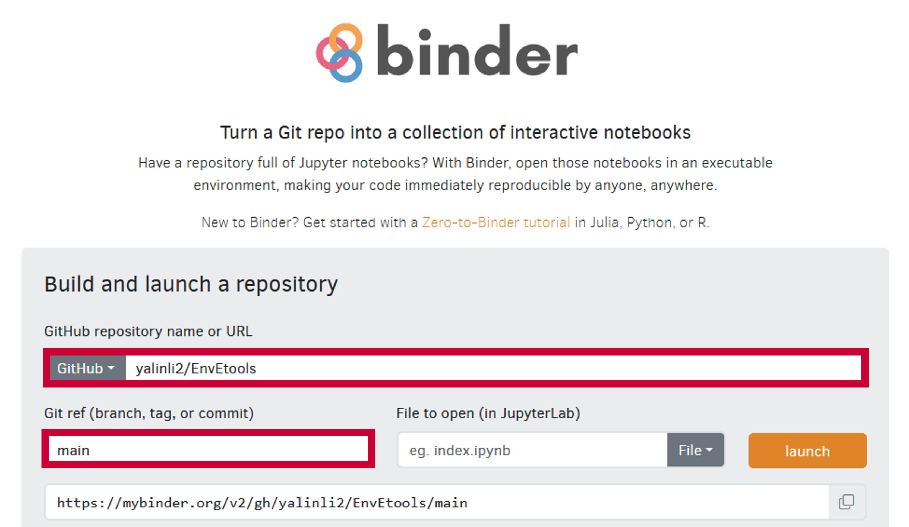

========================================================================
EnvEtools: Course Materials for Environmental Engineering Analysis Tools
========================================================================

.. Status
.. image:: https://img.shields.io/badge/status-under%20development-blue?style=flat
   :target: https://github.com/yalinli2/EnvEtools

.. GitHub test of the main branch
.. image:: https://github.com/yalinli2/EnvEtools/actions/workflows/test-notebook.yml/badge.svg?branch=main
   :target: https://github.com/yalinli2/EnvEtools/actions/workflows/test-notebook.yml

.. image:: https://mybinder.org/badge_logo.svg
   :target: https://mybinder.org/v2/gh/yalinli2/EnvEtools/main

Launching Notebooks in Google Colab
-----------------------------------
Navigate to the individual Jupyter Notebooks in `course_modules </course_modules>`_, then click the |_colab_badge| at the top of each notebook.

.. |_colab_badge| image:: https://colab.research.google.com/assets/colab-badge.svg

Launching Notebooks in Binder
-----------------------------
Method 1 (preferred)
********************
Navigate to the individual Jupyter Notebooks in `course_modules </course_modules>`_, then click the |_binder_badge| at the top of each notebook.

This is the **PREFERRED** method for Binder and should be able to build the Binder environment fairly quickly (within a minute). If this method fails, try the alternative one below, which might take a few to tens of minutes and you might need to refresh the page if it appears to be stuck at the very last step (i.e., when the progress bar goes to the end but nothing happens).

.. |_binder_badge| image:: https://mybinder.org/badge_logo.svg

Method 2
********
If it takes a long time (or it times out), go to https://mybinder.org, enter the information as below:

* GitHub: ``https://github.com/yalinli2/EnvEtools``
* Git ref: ``main``

and click the `launch` button.

About the Author
----------------
Development of QSDedu is led by `Yalin Li <https://yalinli.group/>`_. Please feel free to submit a GitHub issue for your questions and suggestions.

License information
-------------------
Please refer to the `LICENSE </LICENSE>`_ for information on the terms & conditions for usage of this software, and a DISCLAIMER OF ALL WARRANTIES.

